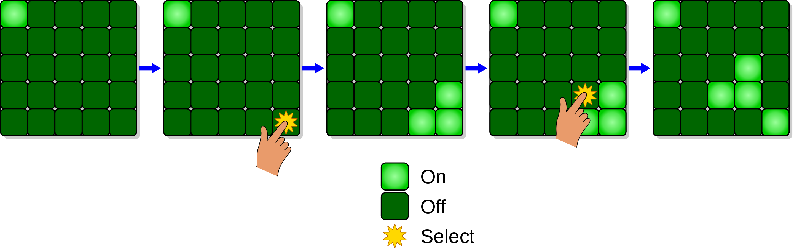
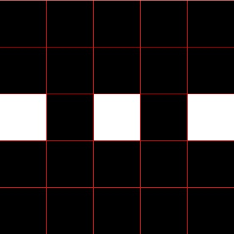

Lights Out
==========
   
In this assignment you will write a JavaScript program using p5 to simulate the Lights Out hand held electronic game that was released by Tiger Electronics in 1995. [Wikipedia has a good article](https://en.wikipedia.org/wiki/Lights_Out_(game)) that describes the game, and you can see an [old commercial for the game on YouTube](https://www.youtube.com/watch?v=pj0lVmhkx7M). You can play the lights out game online [here](https://daattali.com/shiny/lightsout/). You can also read about a strategy to win the game called [Chase the lights](https://help.gnome.org/users/lightsoff/stable/strategy.html.en).

You may find slides 451 to 476 of the [slide presentation](https://docs.google.com/presentation/d/1fm_Di0qR4HpRWTf8tJtcW3u5by3OrilfXIPZ517K1js/edit?usp=sharing) helpful in completing this assignment

Program requirements
--------------------
* Your lights out game must have at least a 5 x 5 grid that uses an 2d array. (Look at the suggestion below for one way to use a 2d array to represent the grid) 
* Your lights out game should tell the user they have won the game if they successfully turn out all the lights
* Customize the HTML and CSS of the web page that displays your game  
* Submit the URL of your game to Google classroom using the "present" link in p5

Suggested steps to completing this assignment
-----------
1. Here is some starter code that draws a 5x5 grid. You can copy and paste this into a new program on [p5](https://editor.p5js.org/). Save your program with a meaningful name like *LightsOut*.
```javascript
var grid = [
    [false, false, false, false, false],
    [false, false, false, false, false],
    [true, false, true, false, true],
    [false, false, false, false, false],
    [false, false, false, false, false]
  ];
function setup() {
  createCanvas(400, 400);
  stroke(255, 0, 0);
}

function draw() {
  drawGrid();
}
function mousePressed() {
  let col = int(mouseX / 80);
  let row = int(mouseY / 80);
  flipLight(row,col);
}
function flipLight(r, c){
  /* your code here */
}
function isValid(r, c){
  /* your code here */
}
function drawGrid(){
  for (var r = 0; r < grid.length; r++)
    for (var c = 0; c < grid[r].length; c++) {
      let x = c * 80;
      let y = r * 80;
      if (grid[r][c] === false) 
        fill(0);
      else 
        fill(255);
      rect(x, y, 80, 80);
    }
}
```
2. Run the program. You should see a 5x5 grid of black and white squares that looks like this: 
3. Now go the declaration `var grid` at the top of the program and change one of the `false` elements to `true`. Run the program and you should see the corresponding square in the grid switch to white.
4. Complete the `flipLight(r, c)` function. It should switch the element at `grid[r][c]` to its opposite. Run the program. You should be able to flip a square back and forth from black to white by clicking on it.
5. Complete the `isValid(r,c)` function. It should return `false` if (r,c) is outside the edges of the grid. In all other cases it should return `true`.
6. Add code to `mousePressed()` that flips the lights at the four neighboring positions if each of those positions is valid.
7. Add code to to `draw()` that checks if the player has successfully solved the puzzle and if so, display an appropriate message. (See slides 474 to 476 of the [slide presentation](https://docs.google.com/presentation/d/1fm_Di0qR4HpRWTf8tJtcW3u5by3OrilfXIPZ517K1js/edit?usp=sharing) for one approach)

Extensions
-----------
If you have extra time, you could customize a winning screen with animation. You might want to add features to your game to make it more challenging. You could make a game with different levels of difficulty. One way to make the game more challenging is to start with a different pattern of randomly lit buttons. Be warned though that not all arrangements are solvable!

[Wolfram Math World](https://mathworld.wolfram.com/LightsOutPuzzle.html) has a good web page that explains the mathematics of the Lights Out Puzzle. (The field of math that is used to solve the Lights Out puzzle is called "linear algebra")

Samples of Student Work
-----------------------
[Alyssa](https://editor.p5js.org/almagtoto-diaz/full/bNR1wJ0-e)   
[Kai](https://editor.p5js.org/kali13/full/kXjj8xibg)   
[Charlene](https://editor.p5js.org/chwu17/full/9q_jzIpuiv)   
[Amy](https://editor.p5js.org/amhuang4/full/MbWsTG8zo)   
[Theo](https://editor.p5js.org/thruefli/full/vC3-EfKhQ)   
[Douglas](https://editor.p5js.org/dolwin/full/wpLeSeiAR)   
[Grace](https://editor.p5js.org/grhuang/full/BTE-_sZgL)   
[Oliver](https://editor.p5js.org/Oliver312/full/FSB3YT50v)   
[Breanna](https://editor.p5js.org/brlew1/full/-rqmpAKvN)   
[Alex](https://editor.p5js.org/alohlenschlager/full/yn4VwM5p2)   
[Justin](https://editor.p5js.org/Daqk1/full/eXplalUSS)   
[Kathleen](https://editor.p5js.org/kaban/full/vOZ497WNG)   
[Jimmy](https://editor.p5js.org/jichen8/full/SuxSQmka2)   
[Peter](https://preview.p5js.org/n_ll/present/JIZKXaOQR)   
[Ben](https://editor.p5js.org/BeWill/full/y0mXtyaVp)   
[Eden](https://editor.p5js.org/edhuang7/full/4s8laZEXN)   
[Kimi](https://editor.p5js.org/kinorway/full/osa-i2X8X)   
[Kathy](https://editor.p5js.org/kalo/full/OAt_8BRyn)   
[Jonathan](https://editor.p5js.org/jolouie1/full/R9LdoTBDY)   
[Rima](https://editor.p5js.org/rimiah/full/N9mcXYKAX)   
[Alyssa](https://editor.p5js.org/alagudelo/full/VS7n9R7n9)   
[Arwyn](https://editor.p5js.org/arbenitez/full/jbpRSPMD8v)   
[Zachary](https://editor.p5js.org/zabernard/full/vD8qdGfzs)   
[Bella](https://preview.p5js.org/bejayanti/present/DGYk-qYD8)   
[Jasmine](https://preview.p5js.org/jaguan4/present/wGQ8hlQRI)    
[Jeffrey](https://preview.p5js.org/JeffreyLin/present/wyIDhqXzE)   
[Kaitlyn](https://preview.p5js.org/kaluu/present/aAjMEwWzd)   
[Alyssa](https://editor.p5js.org/ALJOW/full/7FG-22E1o)   
[Vincent](https://editor.p5js.org/vihuang15/full/3Ezp-Id0g)   
[Jaden](https://editor.p5js.org/jalee13/full/lV8RmKyVK)   
[Aaron](https://editor.p5js.org/aahill1/full/BsCq60Ofi)   
[Pansy](https://editor.p5js.org/pakuang/full/gG_RvGBV7)   
[Justin](https://editor.p5js.org/justinlin8/full/yw6urbDph)   
[McKayla](https://editor.p5js.org/mcma/full/WGRMt1K1C)   
[Owen](https://editor.p5js.org/owsheetz/full/CIIQMoaJ7)   
[Npah](https://editor.p5js.org/BiZaark/full/CR1BBjK0n)   
[Patrick](https://editor.p5js.org/payao/full/jldmpZdIi)   
[Alice](https://editor.p5js.org/alliang/full/vPpJexQgI)   
[Ally](https://editor.p5js.org/alzhao/full/Wb3-e43DT)   
[Rio](https://editor.p5js.org/rihaile/full/5oPvWZOV5)   
[Alejandro](https://editor.p5js.org/alaguilar5/full/h-sHJvekg)   
[Tiffany](https://editor.p5js.org/ticaballero/full/nZygA70Hp)   


